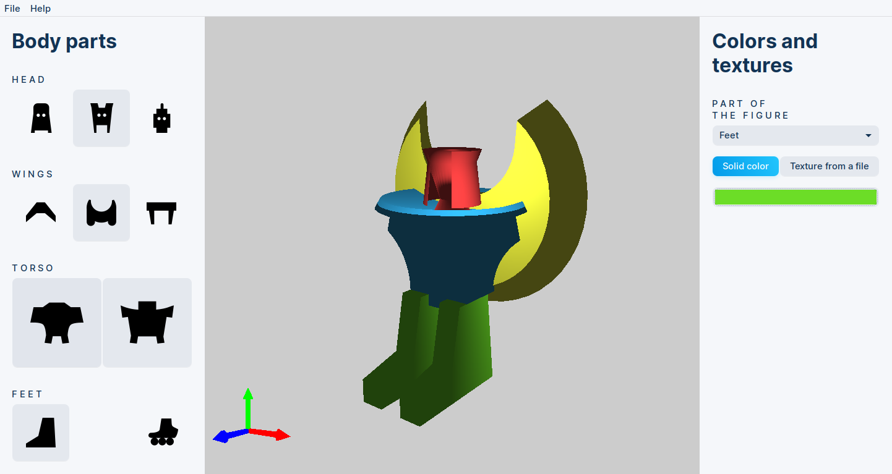

# Robo Editor

### Robo Editor is a small OpenGL application enabling you to create, edit and save your own robot model!

Run `build.sh` to run the build script. Dependencies:

*	`gtk-3.0`
*	`gdk-2.0`
*	`cglm`
*	`sqlite3`
